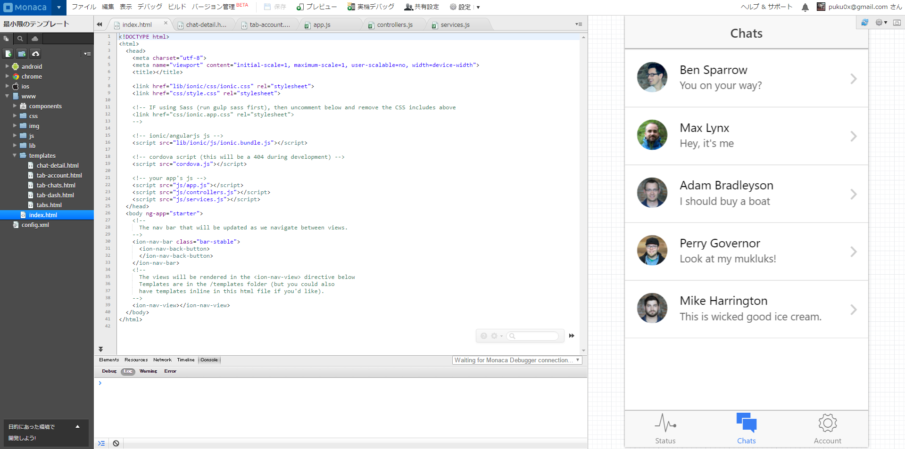

# monaca-ionic
MonacaでIonicを使うサンプル



# 自力で組み込む場合
1. CordovaとIonic CLIをインストールする。
```bash
$ npm install -g cordova
```
```bash
$ npm install -g ionic
```

2. Ionicのサンプルを作成する。
```bash
$ ionic start myApp tabs
```
3. Monacaで新規プロジェクトを作成する。

4. `/myApp/www/`以下をMonacaの`/www/`にアップロードする。
